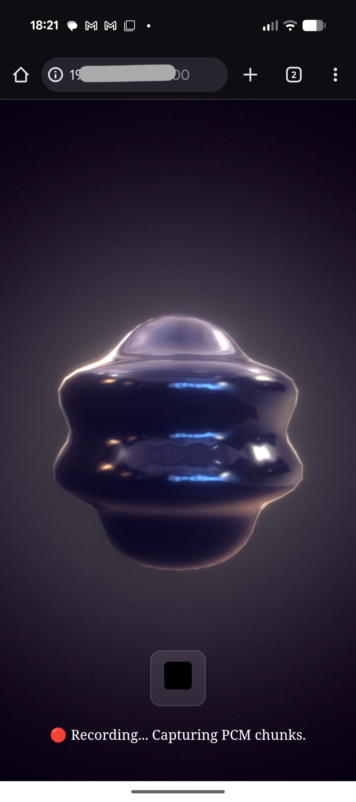

# Gemini Live for Corporate Showrooms

**(Work in Progress)**



## Introduction

This project is a web application for corporate showrooms that uses the Gemini Live API to create an interactive and informative user experience. It features a QR code reader to understand the user's context and will incorporate Augmented Reality (AR) for visual guidance.

## Base Code: `live-audio-sveltekit5`

The `live-audio-sveltekit5` directory contains a SvelteKit version of the official Google AI Studio "Live Audio" sample application, which was originally written in React. The Gemini CLI performed the conversion, and the code has been further modified and commented on for clarity. This codebase serves as the project's foundation.

## Application: `app`

The `app` directory contains the main application.


### Current Implementation

The QR code scanned by the camera will serve as the context of the conversation.

## Deployment on Raspberry Pi

The application is designed to be deployed on a Raspberry Pi, which acts as a local server.

```
                                 Node.js
[Development PC]---- SCP --->[Raspberry Pi]<--- HTTP --->[Browser on Smartphone]
```

To deploy the SvelteKit 5 application to a Raspberry Pi, follow these steps:

1.  **Build and Transfer:**
    Use the following shell script to automate the build and transfer of the application to your Raspberry Pi.

    ```bash
    PASSWORD="******"
    HOST="arao@xxx.xxx.xxx.xxx"
    LOCAL_DIR="/Users/shiny/Documents/GitHub/live/app"
    REMOTE_DIR="/home/arao/live"

    cd $LOCAL_DIR
    echo ">>> App directory: $(pwd)"

    echo ">>> Building the app..."
    npm run build

    echo ">>> Copying the app to the server..."
    sshpass -p "$PASSWORD" ssh $HOST "rm -rf ~/live/build/*"
    sshpass -p "$PASSWORD" scp -r $LOCAL_DIR/build $HOST:$REMOTE_DIR
    sshpass -p "$PASSWORD" scp $LOCAL_DIR/package.json $HOST:$REMOTE_DIR
    sshpass -p "$PASSWORD" scp $LOCAL_DIR/package-lock.json $HOST:$REMOTE_DIR
    ```

2.  **Install Dependencies:**
    SSH into your Raspberry Pi and run `npm install` in the project directory to install the required dependencies.

3.  **Configure Chrome for Android:**
    If you are serving the application over HTTP, you need to enable the following flag in Chrome on your Android device to allow microphone access:
    `chrome://flags/#unsafely-treat-insecure-origin-as-secure`

## References

-   [Web Audio API Tutorial](https://web-audio-api.firebaseapp.com/)
-   [Creating a QR Code Reader in the Browser with jsQR (Japanese)](https://qiita.com/U_sagi/items/12cc39487a863e0136a0)
-   [WebXR/ARCore](https://developers.google.com/ar/develop/webxr)


## Showroom panels

- bach [[link](https://www.gutenberg.org/ebooks/35041)]
- astronomy [[link](https://www.gutenberg.org/ebooks/8172)]

  

  
